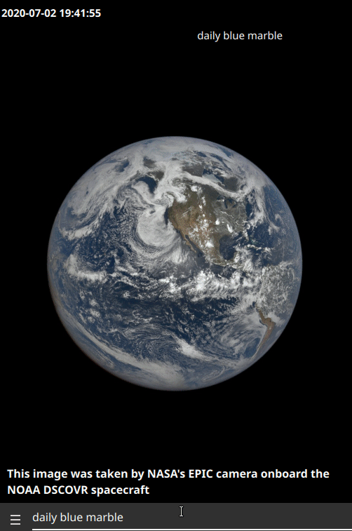
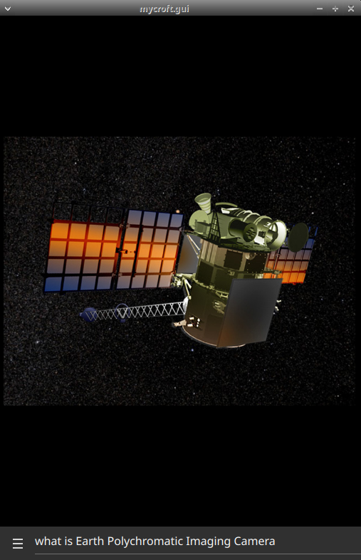

#  Daily Blue Marble

## About

[Earth Polychromatic Imaging Camera](https://epic.gsfc.nasa.gov/) provides near real time pictures of earth from orbit
  
Can be used as homescreen
 

## Examples
* "show me earth from space"
* "Daily Blue Marble"
* "Blue Marble of the Day"
* "Animate that"
* "tell me about Earth Polychromatic Imaging Camera"
* "open the epic website from nasa"
* "what is the location of DSCOVR spacecraft"

## Known Issues

- "what is the location of DSCOVR spacecraft" conflicts with countries skill

## Credits
- JarbasAi
- [NASA](https://apod.nasa.gov/apod/astropix.html)

## Category
**Information**

## Tags
- nasa
- idle screen
- mark2
- bigscreen
